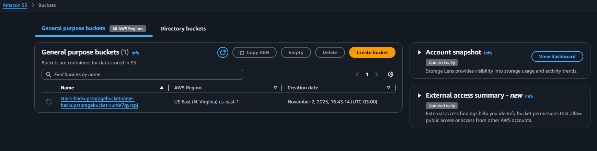
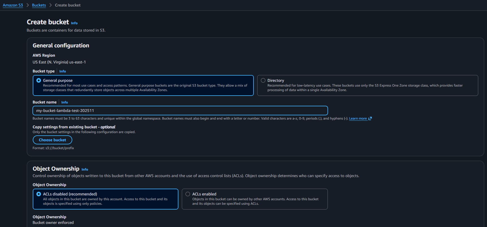
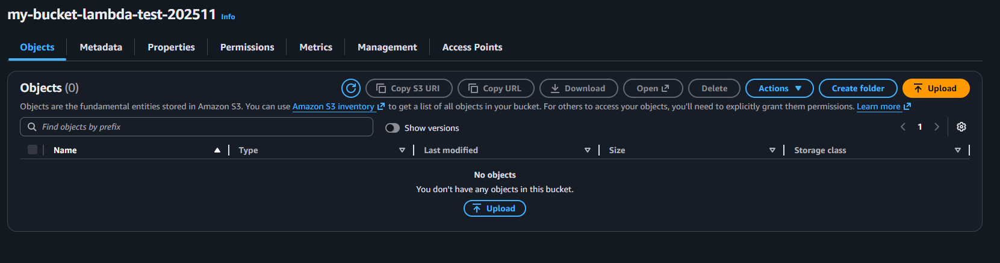
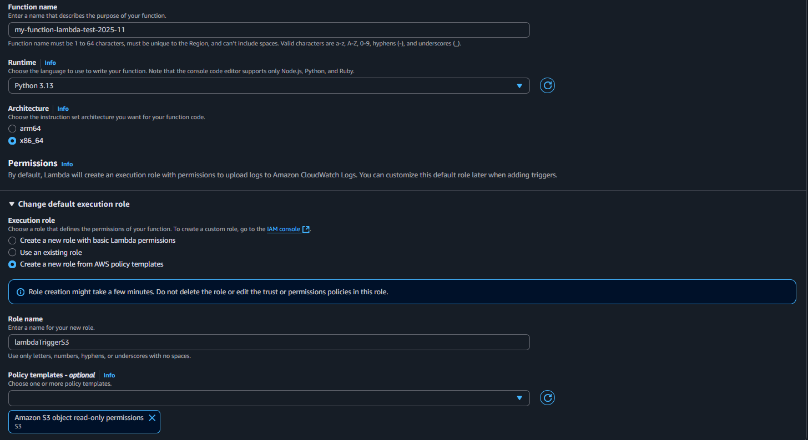
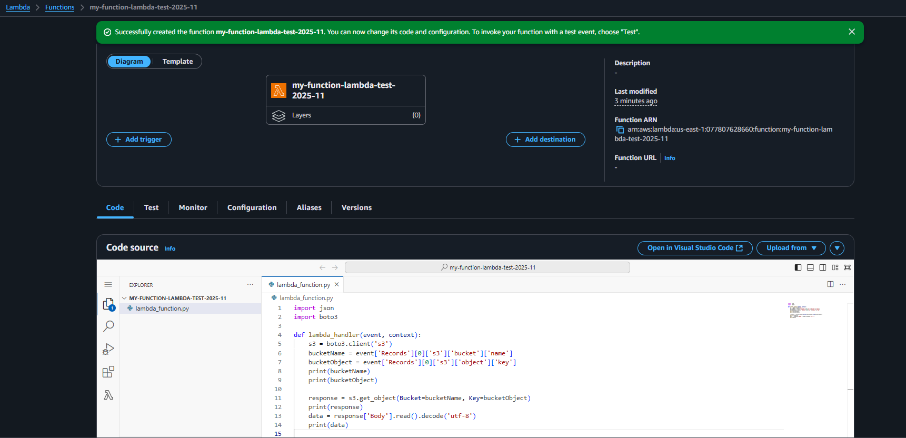
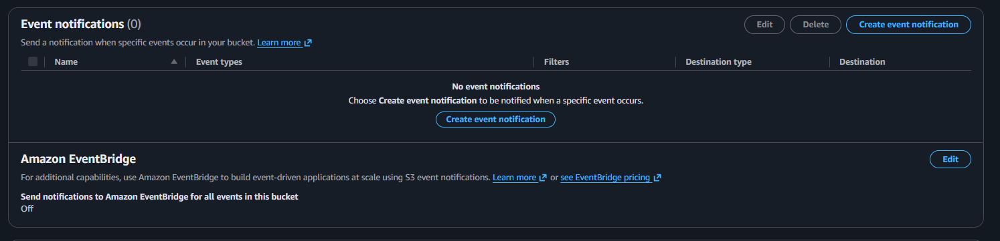
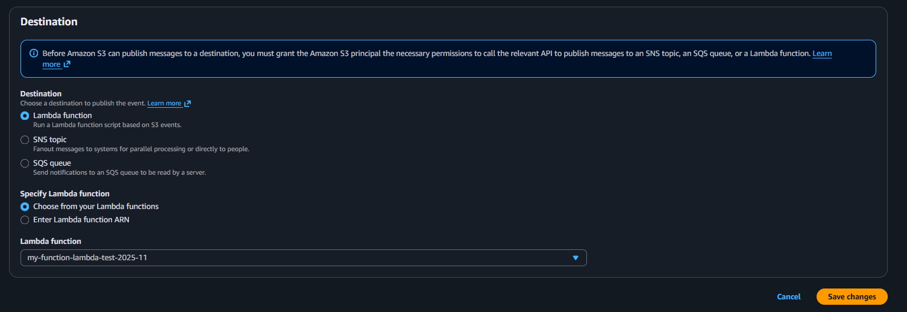
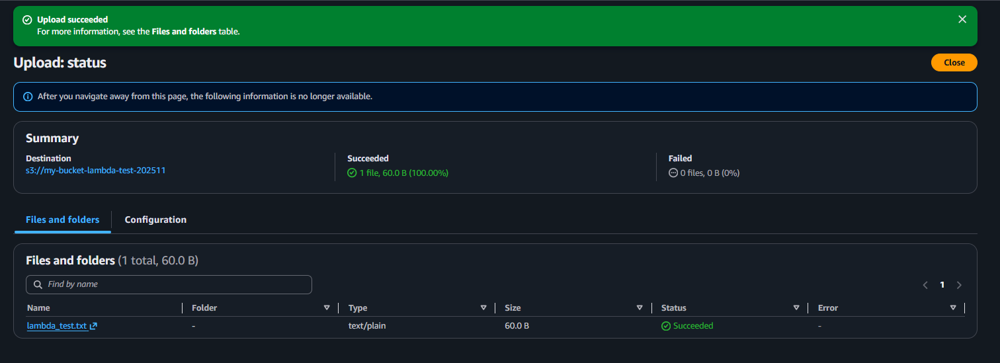
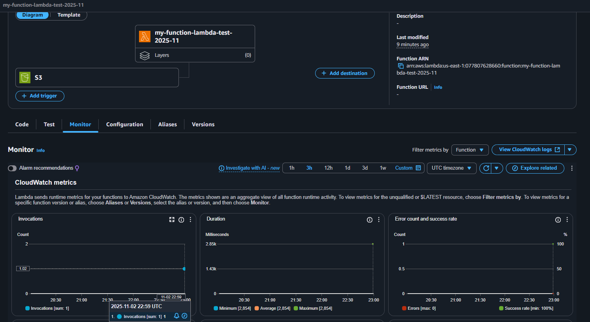
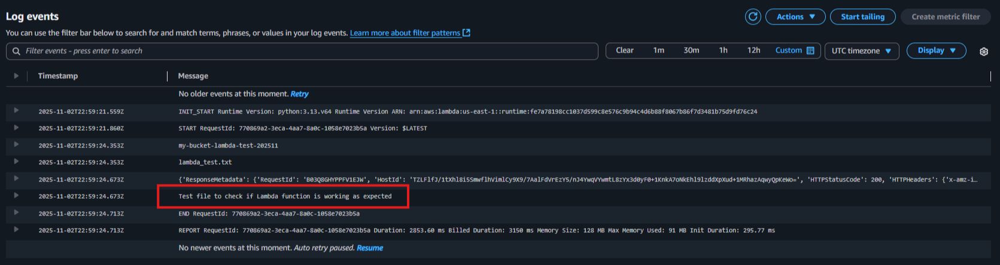

# DIO_Tarefas_Automatizadas
Repositório para armazenar conhecimentos obtidos no curso DIO Santander Code Girls 2025 - Módulo Automação e DevOps na AWS.

# AWS Lambda
Serviço de computação serverless que permite executar código sem precisar gerenciar a infraestrutura (AWS gerencia automaticamente a capacidade, escalabilidade e disponibilidade). A partir de uma função (em Python, Java, etc.) e da definição de uma trigger, o Lambda executa automaticamente o código quando o gatilho é acionado.

Por exemplo, o código é executado em resposta a um evento de Upload de arquivos no S3.

# AWS S3 (Simple Storage Service)
Serviço de armazenamento de objetos em nuvem. Utilizado para armazenar, organizar e recuperar grandes volumes de dados dentro de buckets.

# Localstack
Ferramenta para desenvolvimento e teste de aplicaçãos que utilizam AWS através da emulação dos recursos, permitindo o desenvolvimento e teste de aplicações sem necessidade de utilizar recursos reais da AWS.

# Caso de Uso
Criação de bucket no S3 que, ao sofrer alteração, trigga uma Lambda Function que imprime no log os dados do arquivo adicionado.

**Criação do S3 Bucket**

- Buscar por 'S3' na barra de procura.

- Ao acessar o recurso, selecionar a opção de criação "Create bucket"

- Para realizar a criação do bucket é necessário:
    - Selecionar o propósito como geral
    - Definir um nome (deve ter único em toda a AWS)
    - Manter o ACL disabled (somente a conta que criou o bucket pode gerenciar o acesso)
    - Manter a opção de Block Public Access settings (se não for bloqueado, qualquer pessoa que tem o link de acesso do bucket pode tentar acessá-lo).
    - Selecionar a opção de Bucket Versioning como 'Enable' para manter histórico de alterações no bucket.

- Bucket criado e uploads de objetos podem ser realizados.

**Criação da Lambda Function**

- Buscar por 'lambda' na barra de procura.

- Ao acessar o recurso, selecionar a opção de criação "Create a function"

- Para realização a criação da função é necessário:
    - Nomear a função
    - Selecionar a linguagem de progração utilizada para escrever a função (Python)
    - Alterar o role, adicionando permissão para que essa função consiga ler e escrever no S3.

- A função está criada. Porém, antes de fazer sua associação com o S3, para que o arquivo seja lido e ocorra o print do conteúdo, a função deve ser atualizada (código disponível no arquivo lambda_function.py)

**Linkando a função Lambda ao S3**

- Acessar o bucket criado, acessar as prioridades e criar um 'Event notification'

- Para realizar a criação do evento (trigger) é necessário:
    - Nomear o evento
    - Selecionar a opção de s3:ObjectCreated:Put
    - Selecionar a lamba function criada anteriormente.

**Testando a funcionalidade**

- Arquivo teste adicionado no S3 contendo o texto "Test file to check if Lambda function is working as expected"

- Ao acessar a função é possível observar que a função foi executada uma vez.

- Para acessar os logs gerados pelo código da função (que contém o print do conteúdo do arquivo texto adicionado no S3), selecionar a opção de "View CloudWatch logs" e acessar ao log mais novo que está disponível.

- Observando os logs, é possível encontrar o texto presente no arquivo, comprovando que a integração das funcionalidades está operando conforme esperado.

- Neste exemplo somente está sendo realizado a print do conteúdo do arquivo, porém poderiam ser realizadas integrações com outros recursos AWS (por exemplo, ler um novo arquivo carregado no S3 e enviar os dados para um banco de dados).
